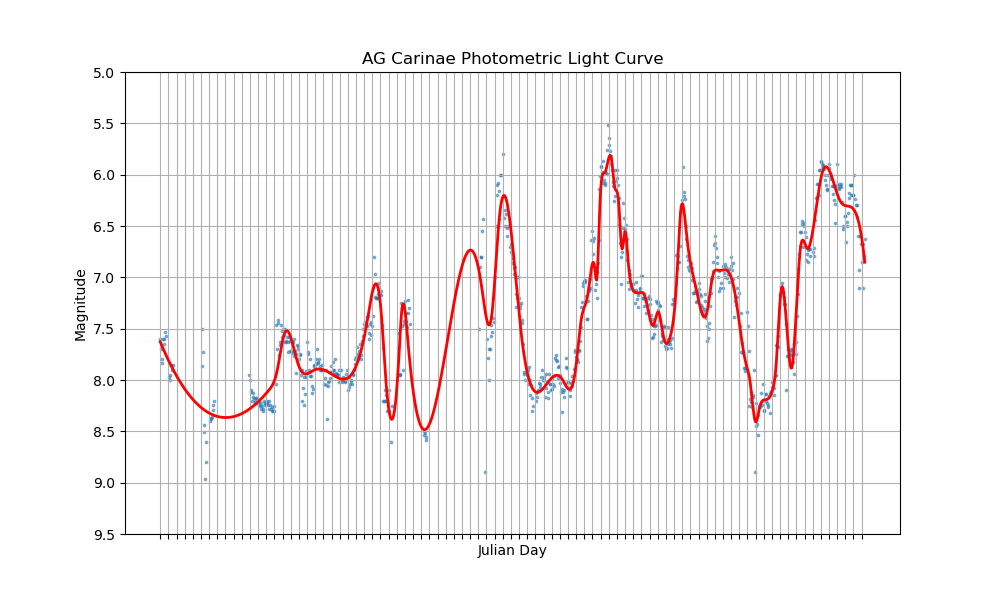

# What is Sonification?
#### Sonification is the process of adapting data into sound to convey information about your data. Similar to how we use plots and graphs to understand data, converting data into sound can also provide insight and enhance data analysis methods. For example, an image can be sonified by scanning an image, typically from one side to the other side, by applying a pitch depending on the location of the pixel, and a volume depending on the brightness of the pixel. More complex examples can use more musical features such as instrument, key signature, and note duration based on other aspects of the data set.

# How can this be used in science?
#### Scientists at the Chandra X-ray Center and System Sounds started the first program at NASA to sonify astronomical data.[^1] While some motivation for the sonification comes from making data accessible to visually impaired individuals, scientists in this project stated that the high learning gains occurred amongst blind and sighted people.

#### Additionally, when creating visual representations of data, we often filter out what we believe is not important in order for the visualization to be digestible to the human eye.[^2] Thus, you can convert your data into sound by including noise, multiple dimensions, and more, without causing oversimplification.

#### For example, consider Eta Carinae. Eta Carinae is a binary star system surrounded by a large nebula called the Homunculus Nebula. Eta Carinae is famous for an eruption that occurred in 1843 which made it the second brightest star in the night sky. Over time, as the two stars in the system orbit each other, gas is ejected from the outer atmosphere of the stars and creates complex structures of material surrounding the system. The 3D printed models produced from 3D simulations of this system revealed structures previously unknown by astronomers.[^3]

#### If you are interested in learning more about the sonification of astronomical data, the hosts of the podcast astro[Sound]bites talked explored this field in more detail in their episode 33: Beyond A[S]B — Scintillating Sounds of Science.[^4]

# Example: Ag Carinae

#### AG Carinae[^5] is a variable star in the Carina constellation and is one of the most luminous stars in the Milky Way Galaxy. Observations of this star have been cataloged from 1941 to today, so the history of the brightness of this star can be sonified!

#### To sonify the data, I normalized the x axis of time such that each beat represents one month. Thus, the note being played conveys the value of the star’s average brightness for that month. The lower octave sound is a fitted model to the data, while the higher octave sound corresponds to the actual data itself.[^6] Thus, one can hear how well their model fits their measured data.

#### Build your own sonification of a Hubble image [here](https://science.nasa.gov/mission/hubble/multimedia/online-activities/hearing-hubble/)![^7]

Links and Sources:

[^1]: [https://chandra.si.edu/sound/](https://chandra.si.edu/sound/)

[^2]: [‘Sonification of Astronomical Data ‘ by Wanda L. Diaz-Merced et. al.](https://www.cambridge.org/core/journals/proceedings-of-the-international-astronomical-union/article/sonification-of-astronomical-data/E6319BD14429311DDD9F11429286C539)

[^3]: [‘A Case Study in Astronomical 3D Printing: The Mysterious η Carinae‘ by Thomas I. Madura](https://iopscience.iop.org/article/10.1088/1538-3873/129/975/058011)

[^4]: [astro[Sound]bites: episode 33](https://astrosoundbites.com/2021/04/11/episode-33-scintillating-sounds-of-science/)

[^5]: [image credit: NASA, ESA, STScI](https://science.nasa.gov/asset/hubble/ag-carinae/)

[^6]: [TwoTone](https://twotone-midiout-beta.netlify.app/)

[^7]: [Hearing Hubble](https://science.nasa.gov/mission/hubble/multimedia/online-activities/hearing-hubble/)
